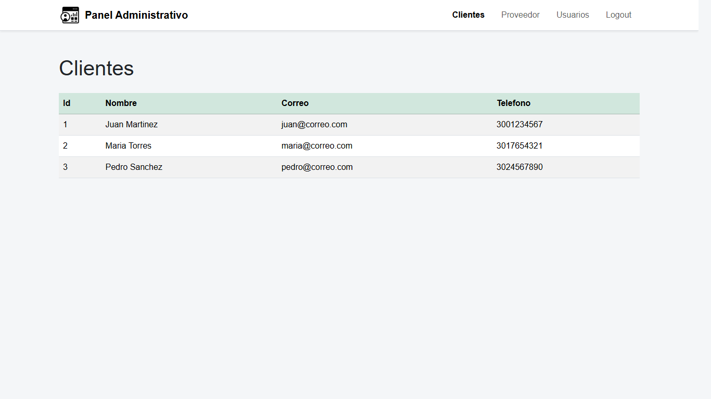
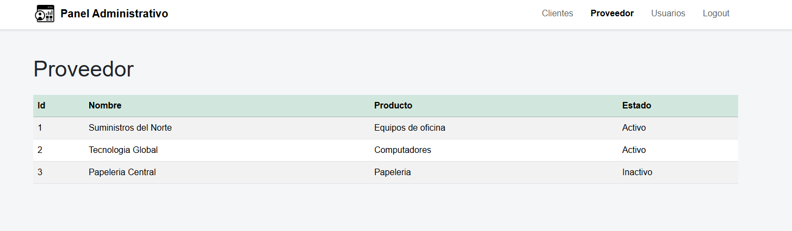
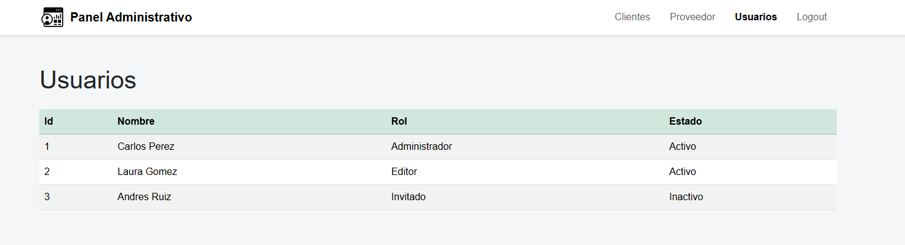

<div align="center">

# Panel Administrativo Web

*Un panel de administración moderno construido con React y Vite.*

</div>


---

## Índice

- [Tecnologías Utilizadas](#tecnologías-utilizadas)
- [Estructura de Navegación](#estructura-de-navegación)
- [Guía de Inicio Rápido](#guía-de-inicio-rápido)
- [Capturas del Proyecto](#capturas-del-proyecto)

---

## Tecnologías Utilizadas

A continuación se listan las principales herramientas y librerías implementadas en el desarrollo:

| Tecnología | Descripción |
| :--- | :--- |
| **[React JS](https://react.dev/)** | Biblioteca principal para construir la interfaz de usuario. |
| **[Vite](https://vitejs.dev/)** | Entorno de desarrollo ultrarrápido y empaquetador. |
| **[React Router](https://reactrouter.com/)** | Gestión de rutas dinámicas del lado del cliente. |
| **[Bootstrap](https://getbootstrap.com/)** | Framework CSS para diseño adaptable y componentes preconstruidos. |
| **[Font Awesome](https://fontawesome.com/)** | Set de íconos vectoriales para la interfaz. |

## Estructura de Navegación

El sistema está dividido en las siguientes secciones, accesibles mediante la barra de navegación:

<details>
<summary><strong>Ver desglose de rutas</strong></summary>

*   `/clientes` : Vista del listado y gestión de clientes.
*   `/proveedor` : Vista del listado y gestión de proveedores.
*   `/usuarios` : Módulo de administración de usuarios del sistema.
*   `/logout` : Ruta para el cierre de sesión y salida segura.

</details>

## Guía de Inicio Rápido

### Requisitos Previos

Asegúrate de tener instalado [Node.js](https://nodejs.org/) en tu sistema.

### Instalación y Ejecución

Sigue los siguientes comandos en tu terminal para poner en marcha el proyecto localmente:

1. **Instalar dependencias:**
   ```bash
   npm install
   ```

2. **Iniciar servidor de desarrollo:**
   ```bash
   npm run dev
   ```

> [!TIP]
> Vite abrirá el servidor en un puerto local. Revisa la salida de la terminal para acceder al enlace (usualmente `http://localhost:5173`).

### Compilación para Producción

Para generar los archivos estáticos optimizados para producción:

```bash
npm run build
```

---

## Capturas del Proyecto

### Panel de Clientes


### Panel de Proveedores


### Panel de Usuarios

